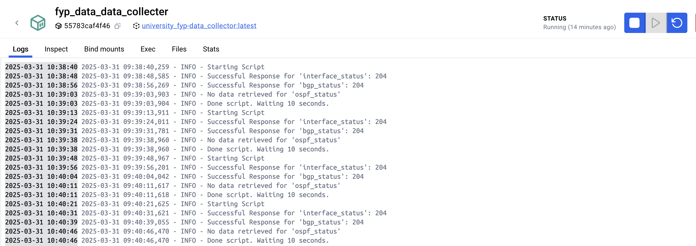

# Project Process
For this project, the process is to be able to do the following seamlessly:
- Collect NETCONF data from two virtual Cisco routers via a python script running on a container.
- Store the collected data from the network devices within a database.
- Create dashboards and alerts from the data.
- When a network issue starts, send alert via a webhook
- Get an LLM to (A) Figure out what the issue is (B) Configure the solution for the issue.

## Network Devices
The network topology for this project consists of two Cisco CSR1000v both running a firmware version of 16.09.07. These two routers were configured and hosted on a Proxmox server. The two network devices were configured with Netconf-yang, which allowed us to use python scripts to grab the data, which is the purpose of the Data Collector.

## Quick Topology Automation
The "network/" directory contains three scripts. Each script will connect to the two lab devices and configure the specific commands. These scripts can either be ran via python or via the Makefile within this repository. 

The "basic_config.py" will configure basic connectivity between the two devices.
The "bgp.py" will configure basic BGP connectivity between the two devices, creating the BPG testing scenario.
The "ospf.py" will configure basic OSPF connectivity between the two devices, creating the OSPF testing scenario.

## Data Collector
Originally, this project was going to utilise Telegraf as a listener and process the NETCONF messages using "inputs.cisco_telemetry_mdt" input and output the data to InfluxDB. However, for this project, there was only access to Cisco version 16.09.07 for the two Cisco CSR1000v which does not support streaming telemetry. So as a result, a container containing a python script was made.

The data collector instance is used to collect network telemetry from our network devices. In this case, the network telemetry protocol being collected is NETCONF. Specifically, it collects BGP, OSPF and Interface data.

The data collector can be ran two ways. This can make it easier for running locally for testing purposes or in a container, making it easier for the whole process.
(1) Locally "--env local"
(2) Container "--env container"

The docker container uses "python3.11-alpine" as its the smallest and most lightweight. It then copies over everything from the repository's directory "data_collector/code" to "/app/" within the container. It then installs the dependencies within "/app/requirements.txt" and use the --no-cache-dir to save space. There is one environment variable which is the token used for our InfluxDB API. Last step is to then run the python script in container mode, making it run continuously until there is an error or there is a force stop.

When the script runs, it will run three device queries:
(1) interface query
(2) BGP query
(3) OSPF query

Each query will be formatted into Line Protocol which is needed when sending information to InfluxDB.

If the query returns nothing, it will skip to the next query and log "No data retrieved for 'X'", X being one of the three queries. After the three queries are ran, it will then log a message like "Done script. Waiting 10 seconds.". After 10 seconds, it will re-run the script until stopped. An example can be seen below:

Figure 1 - Data Collector Logs.

## InfluxDB
The InfluxDB instance is used to store the collect network data. In this case, it stores line protocol data which was formatted via the Data Collector.

The docker container uses "influxdb:2.7-alpine" as its small and lightweight. We have seven environment variables used within this container, which allows the container to self provision. As a result, once the container is ran, there is no basic configuration needed! The environment variables are configured via the docker-compose file, but the required environment variables are:
- DOCKER_INFLUXDB_INIT_MODE
- DOCKER_INFLUXDB_INIT_USERNAME
- DOCKER_INFLUXDB_INIT_PASSWORD
- DOCKER_INFLUXDB_INIT_ORG
- DOCKER_INFLUXDB_INIT_BUCKET
- DOCKER_INFLUXDB_INIT_RETENTION
- DOCKER_INFLUXDB_INIT_ADMIN_TOKEN

Once the environment variables are set, the "influxdb.conf" file is copied over to the container and then the port 8086 is opened on the container.

Once it is up and running, data can be sent to the database and then the data can be queried. For example, Grafana can query the database to make dashboards and alerts.

## Grafana
The Grafana instance is used to create dashboards of the collected data from InfluxDB.

The docker container uses the latest Grafana version. The user is set to "root". After copying over the configuration file, we move all of the different files and directories within the configuration file to appropriate places. This will allow the provisioning of the Grafana dashboards. Grafana requires one environment variable, "INFLUXDB_TOKEN" which allows for communication between Grafana and InfluxDB.

The Grafana instance for this project currently contains two dashboards which both contain two visualisations:
    - Router 1 - BGP - BGP State and Interface Status
    - Router 1 - OSPF - OSPF State and Interface Status

An example of the BGP Dashboard can be seen below:

Figure 2 - BGP Dashboard.

There is a 'contact point' configured for a webhook. When used, it will create a 'POST' request to the API server 'http://host.docker.internal:8000/alert' which will then carry on the rest of the process seen in the file 'process.drawio'.

There is a 'notification policy' configured. The configurations look like this:
    - '0 seconds' when alert is triggered to send a notification to the 'contact point'. 
    - '10 seconds' when the alert is resolved to send a notification to the 'contact point'.
    - '4 hours' when the alert is still triggered to send another notification to the 'contact point'. 
    - NOTE: 4 hours so we don’t cause loops within the LLM process. 

There is two 'alert rules' currently configured. They are:
    - BGP State 
    - OSPF State
    - Both of these are configured to trigger when the dashboard goes below '1'. For the two status pages, it is configured to present "'up status' == 1" and "'down status' == 0". Every '10 seconds' the visualisations are being evaluated and triggered in '0s' if they drop below 0, which starts the alerting process. 

## AI Agent
The API instance is used to start the ai agent process. Once Grafana hits the threshold, it will send a HTTP Post request to the FastAPI webhook. Once this is triggered, it will call the function alert() and pass in the alert description. There are two types of descriptions that are configured on Grafana. One for BGP and one for OSPF. 
- BGP -> There is an issue with BGP for router-1 and its neighbour.
- OSPF -> There is an issue with OSPF for router-1 and its neighbour

The alert function starts the agent process using Langchain. The agent will take use of (A)The LLM (B)Tools provided, to come up with the (A)Issue (B)Configuration to solve issue.

For example, when using LLM "qwen2.5:14b", we got the following output:

Figure 3 - Fully working process fixing BGP Issue.

Note:
- llama3.1:8b -> Useful for show commands and analysing data. Useful for configuration of Loopback address. Not useful when analysing BGP issue and providing appropriate configuration.
- qwen2.5:14b -> Made the whole process seamless.
